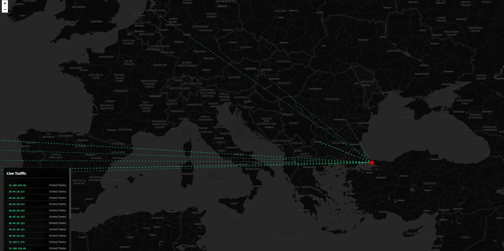
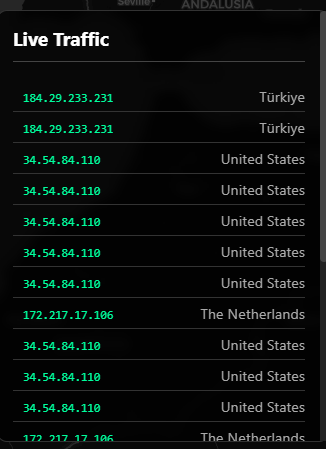
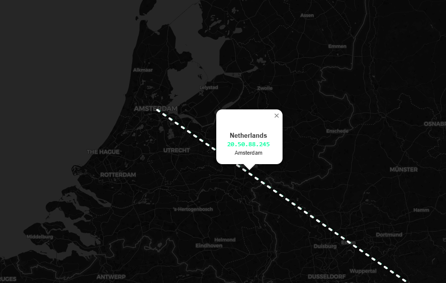

# IP Traffic Visualizer 🌍

A real-time web application that visualizes your network traffic on an interactive world map. It captures outgoing and incoming packets, resolves their geolocation, and draws animated lines connecting your local machine to the destination servers.





## Features ✨

- **Real-time Packet Sniffing**: Uses `scapy` to capture IP traffic on the fly.
- **Live Map Visualization**: Interactive Leaflet.js map with a dark theme.
- **GeoIP Lookup**: Resolves IP addresses to countries and cities using `ip-api.com`.
- **Interactive UI**: Clickable animated lines showing traffic flow with detailed popups.
- **Smart Filtering**: Automatically ignores local traffic and API requests to prevent feedback loops.

## Prerequisites 🛠️

- **Python 3.x**
- **Npcap** (Required for Windows packet sniffing - usually comes with [Wireshark](https://www.wireshark.org/))

## Installation 📥

1.  Clone this repository:
    ```bash
    git clone https://github.com/yourusername/ip-visualizer.git
    cd ip-visualizer
    ```

2.  Install the required Python packages:
    ```bash
    pip install -r requirements.txt
    ```
    
    > **Note:** If `pip` is not recognized in your terminal, try using the Python launcher:
    > ```bash
    > py -m pip install -r requirements.txt
    > ```

## Usage 🚀

1.  Start the application:
    ```bash
    python app.py
    ```
    *(You may need to run your terminal as **Administrator** for packet sniffing to work correctly)*

2.  Open your browser and navigate to:
    ```
    http://localhost:5000
    ```

3.  Allow **Location Access** when prompted by your browser to see the traffic lines originating from your actual location.

## Troubleshooting 🔧

- **No Traffic Showing?**: Ensure you have Npcap installed and are running the terminal as Administrator.
- **Map Lines Not Appearing?**: Make sure you allowed location access in the browser.
- **Timeouts?**: The application includes rate limiting for the free GeoIP API. If you see timeouts, just wait a moment; it will retry automatically.

## License 📄

MIT
